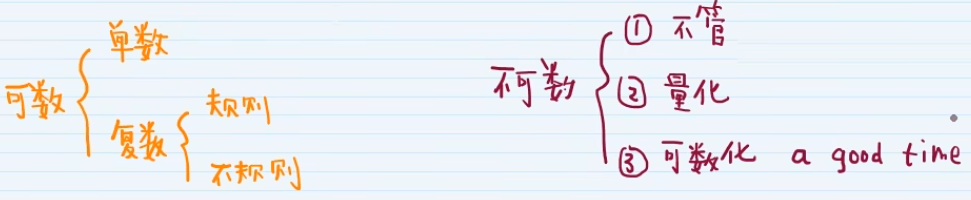

    <h3 style="font-size: 25px;font-weight: 600;letter-spacing: 1px;text-transform: uppercase;margin: 0;">
       English Grammar
    </h3>
    
    	英语语法
    

## 句子成分与基本句型

句子 = 主语(noun) + 谓语(verb)

### 名词

1. ### 名词短语

- **名词短语 = 限定词 + 修饰词 + 主体词**。e.g. a good boy

限定词的构成

- 冠词: a, an, the
- 形容词性物主代词: my, his
- 名词所有格: one's, Tom's
- 指示代词: This, That
- 不定代词: some, every
- 基数词: one, two
- 疑问代词: what, which

    <table>
      <thead>
        <tr>
          <th>限定词</th>
          <th>修饰词</th>
          <th>主体词</th>
          <th>意思</th>
        </tr>
      </thead>
      <tbody>
        <tr>
          <td rowspan="2">a</td>
          <td>good</td>
          <td>boy</td>
          <td>好孩子</td>
        </tr>
        <tr>
          <td>可省略</td>
          <td>boy</td>
          <td>一个男孩</td>
        </tr>
        <tr>
          <td rowspan="2">可数名词复数形式</td>
          <td>good</td>
          <td>boys</td>
          <td>好孩子</td>
        </tr>
        <tr>
          <td></td>
          <td>boys</td>
          <td>男孩们</td>
        </tr>
        <tr>
          <td rowspan="2">不可数名词</td>
          <td>good</td>
          <td>news</td>
          <td>好消息</td>
        </tr>
        <tr>
          <td></td>
          <td>news</td>
          <td>消息</td>
        </tr>
        <tr>
          <td rowspan="2">专有名词</td>
          <td></td>
          <td>china</td>
          <td>中国</td>
        </tr>
        <tr>
          <td></td>
          <td>Tom</td>
          <td>汤姆</td>
        </tr>
        <tr>
          <td rowspan="2">the</td>
          <td>rich</td>
          <td>people（笼统情况下可省略）</td>
          <td>富人</td>
        </tr>
        <tr>
          <td>best</td>
          <td>student（明显情况下可省略）</td>
          <td>最好的学生</td>
        </tr>
      </tbody>
    </table>

2. ### 可数/不可数名词

## 代词

### 人称代词

    <table>
      <thead>
        <tr>
          <th></th>
          <th></th>
          <th>主格 s</th>
          <th>宾格 o.p</th>
          <th>形容词性物主代词 adj+n</th>
          <th>名词性物主代词</th>
          <th>反身代词</th>
        </tr>
      </thead>
      <tbody>
        <tr>
          <td rowspan="2">第一人称</td>
          <td>单数</td>
          <td>I 我</td>
          <td>me 我</td>
          <td>my 我的</td>
          <td>mine 我的</td>
          <td>myself 我自己</td>
        </tr>
        <tr>
          <td>复数</td>
          <td>We 我们</td>
          <td>us 我们</td>
          <td>our 我们的</td>
          <td>ours 我们的</td>
          <td>ourselves 我们自己</td>
        </tr>
        <tr>
          <td rowspan="2">第二人称</td>
          <td>单数</td>
          <td>you 你</td>
          <td>you 你</td>
          <td>your 你的</td>
          <td>yours 你的</td>
          <td>yourself 你自己</td>
        </tr>
        <tr>
          <td>复数</td>
          <td>you 你们</td>
          <td>you 你们</td>
          <td>your 你们的</td>
          <td>yours 你们的</td>
          <td>yourselves 你们自己</td>
        </tr>
        <tr>
          <td rowspan='4'>第三人称</td>
          <td rowspan='3'>单数</td>
          <td>he 他</td>
          <td>him 他</td>
          <td>his 他的</td>
          <td>his 他的</td>
          <td>himself 他自己</td>
        </tr>
        <tr>
          <td>she 她</td>
          <td>her 她</td>
          <td>her 她的</td>
          <td>hers 她的</td>
          <td>herself 她自己</td>
        </tr>
        <tr>
          <td>it 它</td>
          <td>it 它</td>
          <td>its 它的</td>
          <td>its 它的</td>
          <td>itself 他自己</td>
        </tr>
        <tr>
          <td>复数</td>
          <td>they (他/她/它)们</td>
          <td>them (他/她/它)们</td>
          <td>their (他/她/它)们的</td>
          <td>theirs (他/她/它)们</td>
          <td>themselves 他们自己</td>
        </tr>
      </tbody>
    </table>

1. 主格作主语（s）

   eg：**I** like english

2. 宾格作宾语（o）或表语（p）

​		eg：I hate **him**. him 作宾语

​				It is **me**. me 作表语

3. 形容词性物主代词 + n = 名词性物主代词

​		eg：This is my book. my形容性物主代词修饰后面的book名词

​				The book is ours. ours作名词性物主代词后面不可接名词

​		总结：形容性物主代词后面接名词，名词性物主代词后面不接名词

4. 反身代词得现有该人称

​		eg：I love her. 我爱她

​				I leve myself. 我爱我自己

​				I love herself. × 不能我爱他自己

### 指示代词

| 指示代词                  | 数   | 用法                                       |
| ------------------------- | ---- | ------------------------------------------ |
| This 这个 That 那个   | 单数 | 指代或修饰单数或不可数名词，动词用单数形式 |
| These 这些 Those 那些 | 复数 | 指代或修饰复数名词，动词用复数形式         |

1. This、those 指时间或空间上**比较近**的人或物；that、those指时间或空间上**比较远**的人或物
   - This gift is for you and that one is for your borther.
     - 这个礼物是给你的，那个礼物是给你弟弟的（this指近，that指远）
   - I love these books but I don't like those.
     - 我喜欢这些书，但是我不喜欢那些（these指近，those指远）

2. 刚提到过的事情或已经完成的事情用that，即将要发生或将来要提到的事情用this
   - ——I've finished all my homework, mum; ——That's nice
     - ——妈妈，我完成所有作业了；——那太好了
   - ——I'm going hiking this weekend. ——This is very exciting
     - ——本周末我要去徒步旅行。——这真是太令人激动了
3. 在电话用语中，this指自己，that指对方
   - Hello! This is Alan. Who is that speaking?
     - 喂，你好，我说艾伦，你是哪位
4. that/those 还常常用来指代提到过的名词，以避免重复；that特指不可数名词或可数名词单数（物）；those特指可数名词复数（人或物）
   - The days in summer are longer than those in winter
     - 夏天的白天比冬天的白天长 （those代替the days）
5. 指代同类不同个的东西，**that指代可数名词单数和不可数名词**，**those指代可数名词复数**
   - The waether of Chengdu is  cooler than that of Chongqing
      - 成都的天气比重庆的凉快（the weather是不可数名词，所以用that代替Chongqing前面的the weather）

   - The oranges of Huainan are sweeter than those of Huaibei
      - 淮南的橘子比淮北的橘子甜（the oranges是可数名词复数，所以用those代替Huaibei前面的the oranges）

### 不定代词

    <table>
      <thead>
        <tr>
          <th colspan='2'>分类标准</th>
          <th>代词</th>
        </tr>
      </thead>
      <tbody>
        <tr>
          <td rowspan="3">按句法作用分类</td>
          <td>起指代作用</td>
          <td>everybody, everyone, everything,someone,somebody,something,anyone,anybody,anything,no one,none, nobody,nothing 每个人、所有人、一切、某人、某人、某事、任何人、任何人、任何事情、无人、无、无人、无</td>
        </tr>
        <tr>
          <td>起限定作用</td>
          <td>every, no 每一个，没有</td>
        </tr>
        <tr>
          <td>指代与限定作用都有</td>
          <td>each,other,another,either,neither,all,both,many,much,some,any,few,little,a few,a little,one 每个、其他、另一个、要么、要么都不是、全部、两个、很多、很多、一些、任何、少数、少量、一些、一点、一个</td>
        </tr>
        <tr>
          <td rowspan="3">按可数性分类</td>
          <td>可数</td>
          <td>every,each,one,another,either,neither,both,many,few,a few,no one 每一,每一个,一个,另一个,要么,要么都不,两者,许多,几个,一些,没有一个人</td>
        </tr>
        <tr>
          <td>不可数</td>
          <td>much,little,a little 多，少，一点点</td>
        </tr>
        <tr>
          <td>可数与不可数都有</td>
          <td>no,all,none,some,any,other 没有、所有、无、一些、任何、其他</td>
        </tr>
        <tr>
          <td rowspan="5">按构成分类</td>
          <td>普通不定代词</td>          <td>every,each,one,other,another,either,neither,no,all,both,many,much,few,little,a few,a little 每一个、每一个、一个、其他、另一个、要么、要么没有、没有、全部、两者、很多、很多、一些、很少、一些、一点点</td>
        </tr>
        <tr>
          <td rowspan='4'>复合不定代词</td>
          <td>someone,somebody,something 某人，某人，某事</td>
        </tr>
        <tr>
          <td>anyone,anybody,anything 任何人，任何人，任何事情</td>
        </tr>
        <tr>
          <td>everyone,everybody,everything 每个人,每个人,每件事</td>
        </tr>
        <tr>
          <td>no one,none,nobody,nothing 沒有人,沒有人,沒有人,沒有人</td>
        </tr>
      </tbody>
    </table>

### 疑问代词

    <table>
      <thead>
        <tr>
          <th colspan='3'>疑问代词 \ 句法功能</th>
          <th>主语</th>
          <th>宾语</th>
          <th>表语</th>
          <th>定语</th>
        </tr>
      </thead>
      <tbody>
        <tr>
          <td rowspan="3">指人</td>
          <td>主格</td>
          <td>who　谁</td>
          <td>√</td>
          <td>√</td>
          <td>√</td>
          <td></td>
        </tr>
        <tr>
          <td>宾格</td>
          <td>whom　谁</td>
          <td></td>
          <td>√</td>
          <td></td>
          <td></td>
        </tr>
        <tr>
          <td>属格</td>
          <td>whose　谁的（也可指物）</td>
          <td>√</td>
          <td>√</td>
          <td>√</td>
          <td>√</td>
        </tr>
        <tr>
          <td rowspan="2">指物</td>
          <td>主格</td>
          <td>which 哪个（也可指人）</td>
          <td>√</td>
          <td>√</td>
          <td></td>
          <td>√</td>
        </tr>
        <tr>
          <td>宾格</td>
          <td>what　什么</td>
          <td>√</td>
          <td>√</td>
          <td>√</td>
          <td>√</td>
        </tr>
      </tbody>
    </table>

1. who 意思是“谁”，既可以指单数也可以指复数
   - **who** will be the leader of the team
     - 谁将会是这个队的领队（作主语）
2. whom 在句子中只能**作动词或介词的宾语**
   1. With **whom** did you go to the concert
      1. 你和谁去听的音乐会（作介词的宾语）
3. whose 表示“谁的”，既**可以指单数也可指复数**
   1. They each draw a picture, but **whose** is beast?
      1. 他们没人画了一幅画，但是谁的最好？（作主语）
4. which即**可指人也可指物**，即**可指单数也可指复数**
   1. I don't know which to choose
      1. 我不知道该选哪个（作宾语）
5. what意思是“什么”，**代替或修饰可数或不可数名词**
   1. What are your parents?
      1. 你父母是干什么的（作表语）
   2. What interests do you have
      1. 你有什么爱好（作定语）

## 其他语法

### be have been doing

一直在做，未来可能会继续做下去的事情

**for example**: I work as a Software development engineer in a  internet company

### I work as a $adj in a technology company

我在一家科技公司担任***

**for example**: I have been working for 3 years  

### be passionate about doing 

对 *** 热爱

**for example**: I am passionate about coding 我热爱写代码

