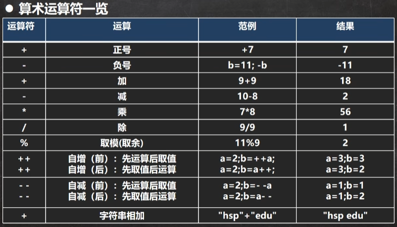

<div style="font-family: 'Kanit', sans-serif;text-align: center;border: 10px solid #fff;box-shadow: 1px 1px 2px #e6e6e6;background: linear-gradient(to left top, #11998e, #38ef7d); padding: 50px 0;">
<div style="color: #fff;">
    <h3 style="font-size: 25px;font-weight: 600;letter-spacing: 1px;text-transform: uppercase;margin: 0;">
       Java Basic
    </h3>
    <span style="font-size: 16px;text-transform: capitalize;">
    	Java基础
    </span>
</div>
</div>

[toc]


## 基本数据类型转换

### 自动类型转换

- 当Java在进行赋值或运算的时候，精度小的类型自动转换为精度大的数据类型，这个就是自动类型转换
- 数据类型按精度（容量）大小排序：
  - char(最小)——>int——>long——>float——>double(最大)
  - byte(最小)——>short——>int——>long——>float——>double(最大)

**案例**

```java
class dataTypeConvert.AutoConvert {
    public static void main(String[] args) {
        // case 1
        int a = 'c';
        double b = 80;
        // 输出 a=97, b=80.0
        System.out.println(a);
        System.out.println(b);
    }
}
```

### 自动类型转换注意和细节

1. 有多种类型的数据混合运算的时候，系统首先自动将所有数据转换成容量最大的那种数据类型，然后在进行计算

```java
class dataTypeConvert.AutoConvert {
    public static void main(String[] args) {
        int num2 = 10;
        // 错误原因：num2 + 1.2 的结果的类型是double，因为在运算过程中自动将数据类型转换成了double，所以赋值给float是错误的
        float f1 = num2 + 1.2;
        System.out.println(f);
        
        // 正确写法1
        double d = num2 + 1.2;
        System.out.println(d);
        
        // 正确写法2
        float f2 = num2 + 1.2F;
        System.out.println(f2);
    }
}
```

2. 当我们把精度大的数据类型赋值给精度小的数据类型时，就会报错，反之就会进行自动类型转换

```java
class dataTypeConvert.AutoConvert {
    public static void main(String[] args) {
        // 错误：精度大的double不能转换成精度小的int
        int n2 = 1.1;
    }
}
```

3. (byte, short) 和 char 之间不会互相自动抓换

```java
class dataTypeConvert.AutoConvert {
    public static void main(String[] args) {
        // byte范围：-128 ~ 127
        // 当把数值赋值给 byte 时，先判断这个数值是否在byte的范围内。
        byte b1 = 10;
        
        // 错误，不在byte范围内
        byte b3 = 1000;
        
        // 如果是按照变量赋值，则需要判断类型
        int n1 = 1;
        byte b2 = n1;
        
        // 错误，byte 和 char 之间不会互相自动抓换
        char c1 = b1;
    }
}
```

4. byte, short, char 他们三者之间可以计算（包括同类型），在计算时首先转换成int类型

```java
class dataTypeConvert.AutoConvert {
    public static void main(String[] args) {
        byte b1 = 1;
        short s1 = 1;
        // 错误，b1+s1的类型是int
        short s2 = b1+s1;
    }
}
```

5. boolean 不参与类型的自动转换
6. 自动提升原则：表达式的结果的类型自动提升为操作数中最大的类型

```java
class dataTypeConvert.AutoConvert {
    public static void main(String[] args) {
        byte b1 = 1;
        short s1 = 102;
        int n1 = 2;
        double d1 = 1.1;
        // 因为在这些变量中，double是精度最大的数据类型，所以最后的结果转换成了double
        double result = b1 + s1 + n1 + d1
    }
}
```

### 基本数据类型转String

1. 基本数据类型转String
   1. 语法：将基本数据类型的值+ ""
   2. 演示：1 + ""
2. String类型转基本数据类型
   1. 语法：通过基本类型的包装类调用parseXXX方法即可
   2. 演示：Integer.parseInt("123")

3. 在将String类型转换成基本数据类型时，要确保String类型能够转成有效的数据，比如，我们不能把 "hello" 转换成一个整数


## 运算符

运算符是一种特殊的符号，用以表示数据的运算、赋值和比较。

1. 算术运算符
2. 赋值运算符
3. 关系运算符 [比较运算符]
4. 逻辑运算符
5. 位运算符
6. 三元运算符

### 算术运算符



1. 自增：++作为独立的语句使用时，不管是++i，还是i++都是一样的，等价
2. 前++和后++都完全等价于 i=i+1
3. ++i 先自增后赋值

```java
class ArithmeticOperator {
    public static void main(String[] args) {
        int i = 1;
        // 规则会使用临时变量
        // 先把i给临时变量 temp=i
        // 然后i = i + 1
        // 最后再把temp给i i = temp
        i = i++;
        System.out.println(i) // result = 1
    }
}
```

4. i++ 先赋值再自增

```java
class ArithmeticOperator {
    public static void main(String[] args) {
        int i = 1;
        // 规则会使用临时变量
        // 先自增：i = i + 1
        // 然后把i给临时变量：temp=i
        // 最后再把temp给i：i = temp
        i = ++i;
        System.out.println(i) // result = 1
    }
}
```

5. **当对一个数取模时，可以等价 a%b = a-a/b*b，比如：11%9 = 11 - 11/9 * 9**

**例题**

```java
class ArithmeticOperator {
    public static void main(String[] args) {
        int i1 = 10;
        int i2 = 20;
        // i1++是先复制再运算，所以先把i1赋值给i，然后i1自增，i = 10, i1 = 11
        int i = i1++;
        System.out.println(i); // result = 10
        System.out.println(i2); // result = 20
        // --i2是先运算再赋值，所以先把i2自减，然后再把i2赋值给i，i=19,i2=19
        i = --i2;
        System.out.println(i); // result = 19
        System.out.println(i2); // result = 19
    }
}
```

