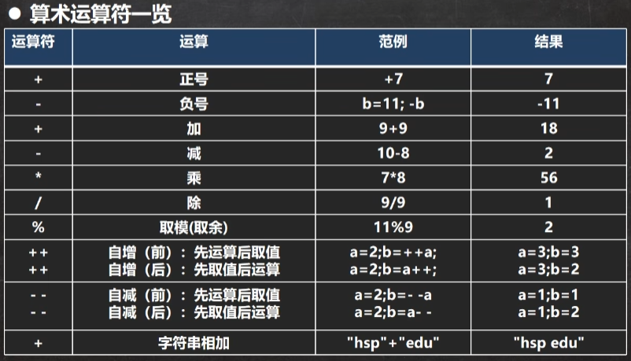

<div style="font-family: 'Kanit', sans-serif;text-align: center;border: 10px solid #fff;box-shadow: 1px 1px 2px #e6e6e6;background: linear-gradient(to left top, #11998e, #38ef7d); padding: 50px 0;">
<div style="color: #fff;">
    <h3 style="font-size: 25px;font-weight: 600;letter-spacing: 1px;text-transform: uppercase;margin: 0;">
       Java Basic
    </h3>
    <span style="font-size: 16px;text-transform: capitalize;">
    	Java基础
    </span>
</div>
</div>

[toc]


## 基本数据类型转换

### 自动类型转换

- 当Java在进行赋值或运算的时候，精度小的类型自动转换为精度大的数据类型，这个就是自动类型转换
- 数据类型按精度（容量）大小排序：
  - char(最小)——>int——>long——>float——>double(最大)
  - byte(最小)——>short——>int——>long——>float——>double(最大)

**案例**

```java
class dataTypeConvert.AutoConvert {
    public static void main(String[] args) {
        // case 1
        int a = 'c';
        double b = 80;
        // 输出 a=97, b=80.0
        System.out.println(a);
        System.out.println(b);
    }
}
```

### 自动类型转换注意和细节

1. 有多种类型的数据混合运算的时候，系统首先自动将所有数据转换成容量最大的那种数据类型，然后在进行计算

```java
class dataTypeConvert.AutoConvert {
    public static void main(String[] args) {
        int num2 = 10;
        // 错误原因：num2 + 1.2 的结果的类型是double，因为在运算过程中自动将数据类型转换成了double，所以赋值给float是错误的
        float f1 = num2 + 1.2;
        System.out.println(f);
        
        // 正确写法1
        double d = num2 + 1.2;
        System.out.println(d);
        
        // 正确写法2
        float f2 = num2 + 1.2F;
        System.out.println(f2);
    }
}
```

2. 当我们把精度大的数据类型赋值给精度小的数据类型时，就会报错，反之就会进行自动类型转换

```java
class dataTypeConvert.AutoConvert {
    public static void main(String[] args) {
        // 错误：精度大的double不能转换成精度小的int
        int n2 = 1.1;
    }
}
```

3. (byte, short) 和 char 之间不会互相自动抓换

```java
class dataTypeConvert.AutoConvert {
    public static void main(String[] args) {
        // byte范围：-128 ~ 127
        // 当把数值赋值给 byte 时，先判断这个数值是否在byte的范围内。
        byte b1 = 10;
        
        // 错误，不在byte范围内
        byte b3 = 1000;
        
        // 如果是按照变量赋值，则需要判断类型
        int n1 = 1;
        byte b2 = n1;
        
        // 错误，byte 和 char 之间不会互相自动抓换
        char c1 = b1;
    }
}
```

4. byte, short, char 他们三者之间可以计算（包括同类型），在计算时首先转换成int类型

```java
class dataTypeConvert.AutoConvert {
    public static void main(String[] args) {
        byte b1 = 1;
        short s1 = 1;
        // 错误，b1+s1的类型是int
        short s2 = b1+s1;
    }
}
```

5. boolean 不参与类型的自动转换
6. 自动提升原则：表达式的结果的类型自动提升为操作数中最大的类型

```java
class dataTypeConvert.AutoConvert {
    public static void main(String[] args) {
        byte b1 = 1;
        short s1 = 102;
        int n1 = 2;
        double d1 = 1.1;
        // 因为在这些变量中，double是精度最大的数据类型，所以最后的结果转换成了double
        double result = b1 + s1 + n1 + d1
    }
}
```

### 基本数据类型转String

1. 基本数据类型转String
   1. 语法：将基本数据类型的值+ ""
   2. 演示：1 + ""
2. String类型转基本数据类型
   1. 语法：通过基本类型的包装类调用parseXXX方法即可
   2. 演示：Integer.parseInt("123")

3. 在将String类型转换成基本数据类型时，要确保String类型能够转成有效的数据，比如，我们不能把 "hello" 转换成一个整数


## 运算符

运算符是一种特殊的符号，用以表示数据的运算、赋值和比较。

1. 算术运算符
2. 赋值运算符
3. 关系运算符 [比较运算符]
4. 逻辑运算符
5. 位运算符
6. 三元运算符

### 算术运算符



1. 自增：++作为独立的语句使用时，不管是++i，还是i++都是一样的，等价
2. 前++和后++都完全等价于 i=i+1
3. ++i 先自增后赋值

```java
class ArithmeticOperator {
    public static void main(String[] args) {
        int i = 1;
        // 规则会使用临时变量
        // 先把i给临时变量 temp=i
        // 然后i = i + 1
        // 最后再把temp给i i = temp
        i = i++;
        System.out.println(i) // result = 1
    }
}
```

4. i++ 先赋值再自增

```java
class ArithmeticOperator {
    public static void main(String[] args) {
        int i = 1;
        // 规则会使用临时变量
        // 先自增：i = i + 1
        // 然后把i给临时变量：temp=i
        // 最后再把temp给i：i = temp
        i = ++i;
        System.out.println(i) // result = 1
    }
}
```

5. **当对一个数取模时，可以等价 a%b = a-a/b*b，比如：11%9 = 11 - 11/9 * 9**


**例题**

```java
class ArithmeticOperator {
    public static void main(String[] args) {
        int i1 = 10;
        int i2 = 20;
        // i1++是先复制再运算，所以先把i1赋值给i，然后i1自增，i = 10, i1 = 11
        int i = i1++;
        System.out.println(i); // result = 10
        System.out.println(i2); // result = 20
        // --i2是先运算再赋值，所以先把i2自减，然后再把i2赋值给i，i=19,i2=19
        i = --i2;
        System.out.println(i); // result = 19
        System.out.println(i2); // result = 19
    }
}
```


## 位运算符

按位与 &

- 两位全为1，结果为1，否则为0

按位或 |

- 两位有一个为1，结果为1，否则为0

按位异或 ^

- 必须是两位一个为0，一个为1，结果才为1，否则为0

按位取反 ~ 

- **运算顺序：原码 -> 反码 -> 补码 -> 补码取反 -> 再取反码 -> 再取补码**
- 正数的按位取反是本身加一再取负
- 负数的按位取反是本身减一再取正

算数右移 >>

- 低位溢出，符号位不变，并用符号位补溢出的高位
- **正数的算术右移相当于右移几位就除以几个2，有小数则忽略小数**
- **负数的取反运算顺序**：原码 -> 补码 -> 符号位不变，加1 -> 右移(高位补1) -> 按位取反 -> 加1

算数左移 <<

- 符号位不变低位补0
- **正数的的算术左移相当于左移几位就乘以几个2**

逻辑右移 >>>

- 也叫无符号右移，规则是低位溢出，高位补0


### 原码反码补码

有符号的数

1. 二进制的最高位是符号位：0表示证书，1表示复数
2. 正数的原码、反码、补码都一样
3. 负数的反码 = 它的原码符号位不变，其它位取反
4. 负数的补码 = 它的反码 + 1，负数的反码 = 负数的补码 - 1
5. 0的反码、补码都是0
6. Java没有无符号数，Java中的数都是有符号的
7. 在计算机运算的时候，它都是以补码的方式来运算
8. 当我们看运算结果的时候，要看他的原码


```java
class Budget {
    public static void main(String[] args) {
        
        int a=1>>2; // a = 0
        // -1 >> 2
        // 原码 10000001
        // 补码 11111110
        // 加一 11111111
        // 右移 11111111
        // 取反 10000000
        // 加一 10000001
        int b=-1>>2;// b = -1
        int c=1<<2; // c = 4
        int d=-1<<2; // d = -4
        
        System.out.println(2&3); // 2
        System.out.println(~-2); // 1
        System.out.println(~2); // -3
        System.out.println(2|3); // 3
        System.out.println(2^3); // 3
    }
}
```


## Switch 分支结构

- 表达式数据类型，应和case后的常量类型一致，或者是可以自动转换成可以比较的类型
- switch中表达式的返回值必须是：（byte, short, int, char, enum, String)
- case子句中的值必须是常量，不能是变量
- default子句是可选的
- break语句用来执行完一个case分支后使程序跳出switch语句块，不写则会按顺序执行到switch结尾


## for 循环

```java
class ForCycle {

    public static void main(String[] args) {
        // Question 1：打印星号直角三角形
        for (int i = 1; i < 10; i++) {
            for (int j = 1; j < i; j++) {
                System.out.print(j + "×" + i + "=" + i * j + "\t");
            }
            System.out.println();
        }
        
        // Question 1：打印星号金字塔
        for (int i = 1; i <= 5; i++) {
            for (int k = 1; k <= 5 - i; k++) {
                System.out.print(" ");
            }
            for (int j = 1; j <= 2 * i - 1; j++) {
                System.out.print("*");
            }
            System.out.println();
        }
        
		// Question 1：打印星号空心星号金字塔
        int total_loop = 50;
        for (int i = 1; i <= total_loop; i++) {
            for (int k = 1; k <= total_loop - i; k++) {
                System.out.print(" ");
            }
            for (int j = 1; j <= 2 * i - 1; j++) {
                if (j == 1 || j == 2 * i - 1 || i == total_loop) {
                    System.out.print("*");
                } else {
                    System.out.print(" ");
                }
            }
            System.out.println();
        }
    }
}
```


## 数组

1. 数组是多个相同类型数据的组合，实现对这些数据的统一管理

2. 数组中的元素可以是任何数据类型，包括基本类型和引用类型，但是不能混用。

3. 数组创建后，如果没有赋值，有默认值 

   1. int=0
   2. short=0
   3. byte=0
   4. long=0
   5. float=0.0
   6. double=0.0
   7. char=\u0000
   8. boolean=false
   9. String=null

4. 使用数组的步骤：1.声明数组并开辟空间 2.给数组各个元素赋值 3.使用数组

5. 数组的下标是从0开始的

6. 数组下标必须在指定范围内使用，否则报:下标越界异常，比如int [] arr=new int[5]; 则有效下标为 0-4

7. 数组属引用类型，数组型数据是对象(object)

### 数组赋值机制

1. 基本数据类型赋值，这个值就是具体的数据，而且互相不影响，是值拷贝。

```java
class DataTypeAssign {
    public static void main(String[] args) {
        int n1 = 2;
        int n2 = n1;
        n2 = 80;
        System.out.println(n1) // 2
        System.out.println(n2) // 80
    }
}
```

2. 数组在默认情况下是引用传递，赋值的是地址，是引用拷贝

```java
class ArrayAssign {
    public static void main(String[] args) {
        int[] arr1 = {1,2,3};
        int[] arr2 = arr1;
        arr2[0] = 9;
        for(int i = 0; i< arr1.length; i++){
            System.out.println(arr1[i]) // {9,2,3}
        }
    }
}
```

### 数组拷贝

编写代码实现数组拷贝（内容赋值）

```java
class ArrayCopy {
    public static void main(String[] args) {
        int[] arr1 = {1,2,3};
        int[] arr2 = new int[arr1.length];
        
        for(int i = 0; i< arr1.length; i++){
            arr2[i] = arr1[i]
        }
        
        arr2[0] = 9;
        for(int i = 0; i< arr1.length; i++){
            System.out.println(arr1[i]) // {1,2,3}
        }
        
        for(int j = 0; j< arr2.length; j++){
            System.out.println(arr1[j]) // {9,2,3}
        }
    }
}
```

### 数组反转

把数组的元素内容反转，arr{1,2,3,4,5,6} -> {6,5,4,3,2,1}

```java
class ArrayReversal {
    public static void main(String[] args) {
        // method 1
        int[] arr1 = {1, 2, 3, 4, 5, 6};
        int len = arr1.length;
        for (int i = 0; i < len / 2; i++) {
            int temp = arr1[i];
            arr1[i] = arr1[len - i - 1];
            arr1[len - i - 1] = temp;
        }
        for (int i = 0; i < len; i++) {
            System.out.print(arr1[i] + "\t");
        }
        
        // method 2
        int[] arr2 = {1, 2, 3, 4, 5, 6};
        int arr2Length = arr2.length;
        int[] arr3 = new int[arr2Length];
        for (int i = 0; i < arr2Length; i++) {
            arr3[i] = arr2[arr2Length - i - 1];
        }

        for (int i = 0; i < arr3.length; i++) {
            System.out.print(arr3[i] + "\t");
        }
    }
}
```

### 数组扩容
