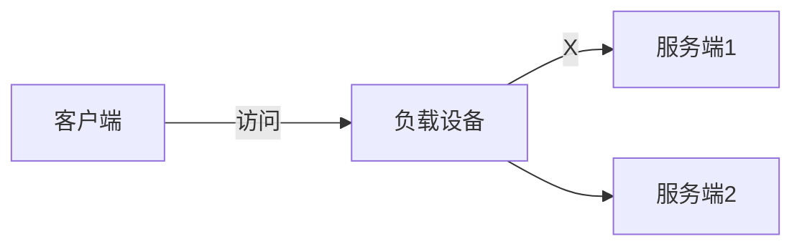
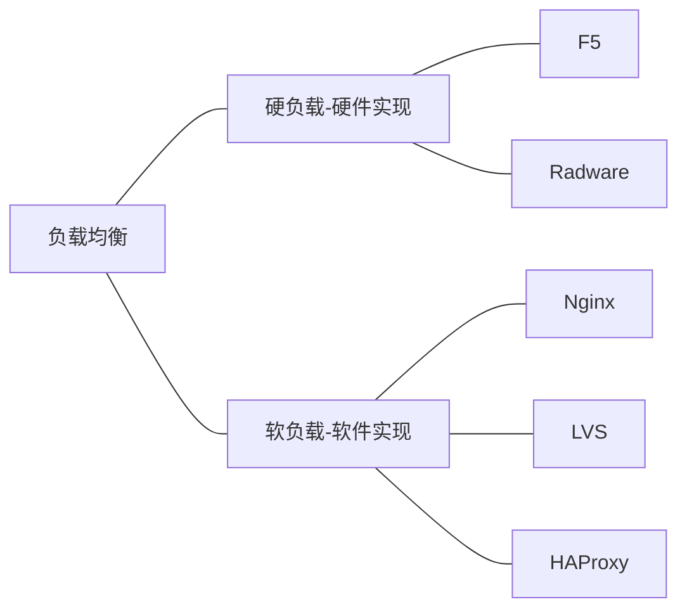

<div style="font-family: 'Kanit', sans-serif;text-align: center;border: 10px solid #fff;box-shadow: 1px 1px 2px #e6e6e6;background: linear-gradient(to left top, #11998e, #38ef7d); padding: 50px 0;">
<div style="color: #fff;">
    <h3 style="font-size: 25px;font-weight: 600;letter-spacing: 1px;text-transform: uppercase;margin: 0;">
       架构基础-从需求到架构
    </h3>
    <span style="font-size: 16px;text-transform: capitalize;">
    	读书笔记
    </span>
</div>
</div>

[toc]


## 大型互联网架构设计的四大原则


- 高可用原则：系统应该最大程度的保证服务的可用性，缩短服务因为各种故障而不可用的时间，具有极高的稳定性和容错性
- 高伸缩原则：系统的服务能力应该可以随时根据需要进行伸缩，具有较强水平的扩展能力，当服务压力比较大时，能够提高计算能力，存储能力，传输能力；当服务压力比较小时，能够减小服务规模，减少资源投入
- 高并发原则：系统应该具有承载超高并发请求的能力，在保证系统可用性的同时，具有更快的响应速度和更好的用户体验
- 安全性原则：系统要具有足够的安全防护能力，网络、服务器，存储、数据都要进行相应的安全设计，以应对各式各样的安全威胁


## 1.1 高可用设计（High Availability，HA）

### 1.1.1 高可用指标

计算公式：**( 1- 年度不可用小时数 / 年度总小时数 ) * 100%**

| 指标简称 | 年度可用性指标 | 最大不可用时长  | 可用性级别         |
| -------- | -------------- | --------------- | ------------------ |
| 2个9     | 99%            | 88小时（3.7天） | 及格（基本可用）   |
| 3个9     | 99.9%          | 9小时           | 中等（可用性较高） |
| 4个9     | 99.99%         | 53分钟          | 优秀（可用性很高） |
| 5个9     | 99.999%        | 5分钟           | 极佳（可用性极高） |

一般2B（To Business）系统或企业内部管理系统达到2个9即可，2C（To Customer）系统至少要达到3个9。


### 1.1.2 冗余设计

​	系统中某个单节点故障可能会引起级联故障。这个单节点的问题会导致很快的传遍所有依赖的节点，造成大量的业务功能无法使用的情况甚至全面宕机。如果下图中的D服务故障的时候，就会造成B、C服务出现大量交易失败和请求积压，问题会很快传遍整个业务线。

```Mermaid
flowchart LR
	A-- 调用 --->B-- 调用 --->D-- 调用 --->E
	B-- 调用 --->C
	C-- 调用 --->D
```

​	冗余是高可用的核心思想，坚决避免服务出现单节点故障，做法就是增加备用节点，方案如下：

1. 主备高可用方案：即给一个系统准备两台硬件配置、环境信息、应用部署都完全一致的服务器A和B，如果A服务器宕机了，立马把B服务器启动起来，顶替A服务器对外提供服务。
2. 多活高可用方案：为了避免单节点故障，可以部署多个同样的服务节点，同时提供服务。


### 1.1.3 负载均衡架构设计

​	负载均衡架构是一种应用较为广泛的高可用手段，可以快速的为其他服务提供水平扩展能力。使用负载均衡结构时，一个服务端发生故障以后，依然有另一个节点可以对外提供服务。如果服务端压力过大，也可以通过增加多个服务节点来分担压力，这也是提高系统高可用的一种手段。



**1）负载设备的实现**

负载设备可以通过硬件和软件实现，因此负载均衡分为硬负载和软负载，如下图。硬负载和软负载的优缺点有：

- 硬负载
  - 优点：性能高、稳定性强
  - 缺点：价格昂贵、不利于开发人员维护
- 软负载
  - 优点：灵活性强、易于配置
  - 缺点：性能和稳定性受操作系统限制



**2）负载均衡高可用方案**